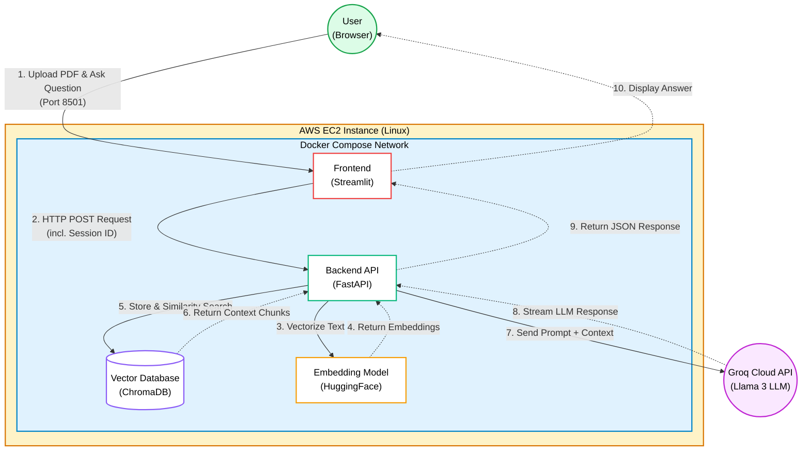

# PDF AI Assistant
This is a small RAG-based assistant system. You upload a PDF and ask questions concerning the content. An LLM gives precise responses that are purely based on the context of the uploaded document.

You can access the deployed tool under: http://51.21.194.93:8501

## System Architecture

## Tech Stack
Frontend:
  - Streamlit (UI)
  - Requests (API communication)

Backend:
  - FastAPI (RESTful API)
  - LangChain (orchestration)
  - ChromaDB (Vector database)
  - Groq API (LLM: llama-3.3-70b-versatile)
  - HuggingFace (Embeddings: all-MiniLM-L6-v2)

Infrastructure:
  - Docker
  - I used AWS EC2 for deployment

